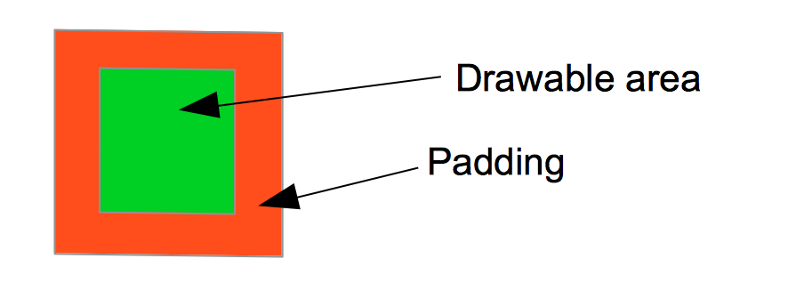

# **Still in development, there will be a lot of changes in code and readme**

# Custom Load View

* Making a custom view can be quite troublesome if you've never done it before and depending on the use case.

## onMeasure()

* Before starting to draw, we should make sure that the `Canvas` we'll be drawing on has the size we want. Think of the `Canvas` as a piece of paper you draw on. If the paper is too small, your drawing won't fit. If your paper is to big, it will take an unnecessary amount of space in a collage or on the wall.
* To follow next code snippet you should read and understand the **Layout** section, http://developer.android.com/reference/android/view/View.html#Layout
  * If `WRAP_CONTENT` is set as size we want the view to be as small as possible with guarantee that the view will fit. `SIZE = MIN SIZE`
  * When a size is specified as `EXACTLY` or as `MATCH_PARENT`, we want the view to have the exact size or the size of the parent. `SIZE = EXACT` or `SIZE = SIZE PARENT`
  
* When we take into account that for our use case we want the view to be square we get the following method.

```
override fun onMeasure(widthMeasureSpec: Int, heightMeasureSpec: Int) {

  val widthMode = MeasureSpec.getMode(widthMeasureSpec);
  val widthSize = MeasureSpec.getSize(widthMeasureSpec);
  val heightMode = MeasureSpec.getMode(heightMeasureSpec);
  val heightSize = MeasureSpec.getSize(heightMeasureSpec);
  var size: Int = 0
    
  when {
    (layoutParams.width == MATCH_PARENT && layoutParams.height == MATCH_PARENT) -> size = getExact(widthSize, heightSize)
    (widthMode == MeasureSpec.EXACTLY && heightMode != MeasureSpec.EXACTLY) -> size = getExact(widthSize, 0)
    (heightMode == MeasureSpec.EXACTLY && widthMode != MeasureSpec.EXACTLY) -> size = getExact(0, heightSize)
    (heightMode == MeasureSpec.EXACTLY && widthMode == MeasureSpec.EXACTLY) -> size = getExact(widthMode, heightMode)
    else -> size = minSize
  }
    
  setMeasuredDimension(size, size);
}
```

* The above piece of code will become clear in a moment, but **copying this useless!!** as this piece of code is the result of my specific use case and my decisions.
* First thing we do is get all the `MeasureSpec` data we need, the measure modes and the sizes passed to us.
* Understanding the modes, if a specific size is passed in xml, the mode for that size will be `MeasureSpec.EXACTLY`. Since in my use case I will be drawing a circle. I want a square canvas, thus I will take the exactly size as a side length. In case both are passed a specific size, we will set the biggest as the side length.
* If both are set to match_parent, assign the maximum size
* In all cases that don't match two conditions above, we will assign the minimum size.

#### Padding support

* Adding padding support for padding is not required, that's why it resides in a seperate topic.
* I recommened adding padding support from the start, to make your view more flexible and reuseable and uniform with your code and the Android system. 
* Padding behaviour:
  * When we add padding to a view set to `WRAP_CONTENT` it's the equivalent of  the view being as small as possible plus the extra padding area around it. So adding padding to `SIZE = MIN SIZE + PADDING`
  * When a size is specified `EXACTLY` or we set to the size to `MATCH_PARENT` the size of the view may **not** be increased, padding now reduces the "useable" space inside the canvas. So we can conclude that his has no effect in our `onMeasure()`method. `SIZE = EXACT SIZE` or `SIZE = SIZE PARENT`

* Knowing this, it's quite easy to add padding functionality for us in our `onMeasure()` method. In the case that `minSize` would be determined as the size, we increase minSize with the padding.
```
var w: Int = 0
var h: Int = 0

when {
  (layoutParams.width == MATCH_PARENT && layoutParams.height == MATCH_PARENT) -> { w = getExact(widthSize, heightSize); h = w }
  (widthMode == MeasureSpec.EXACTLY && heightMode != MeasureSpec.EXACTLY) -> { w = getExact(widthSize, 0); h = w }
  (heightMode == MeasureSpec.EXACTLY && widthMode != MeasureSpec.EXACTLY) -> { w = getExact(0, heightSize); h= w }
  (heightMode == MeasureSpec.EXACTLY && widthMode == MeasureSpec.EXACTLY) -> { w = getExact(widthMode, heightMode); h= w }
  else -> { w = minSize + paddingStart + paddingEnd; h =  minSize + paddingTop + paddingBottom }
}

setMeasuredDimension(w, h);
```

* This is all we need to do to add padding support in this use case. It might be quite different, but once your onMeasure works as intended. We can finally begin with the fun stuff!


## onDraw()

* This is where all the magic happens and you draw your very own view!
* It is **important** that you keep your onDraw method as fast as possible. Since you have no control of how much it's called. Let's say it's slow, and another view calls `requestLayout()` your view's `onDraw()` might be called quite frequently. For that reason I choose to declare my variables outside of the `onDraw()` method.

```
override fun onDraw(canvas: Canvas) {
  paint.color = outerColor
  canvas.drawArc(0f, 0f,width.toFloat(), height.toFloat(), 270f, (360f / max) * progress, true, paint)
  
  paint.color = innerColor
  sizeInnerCircle = (width - sizeOuterCircle).toFloat()
  canvas.drawCircle(width.toFloat() / 2, height.toFloat() / 2, sizeInnerCircle / 2, paint)
}
```

* Let's break it down: We have an inner and an outer part.
  * The inner part is our `FAB`, so let's just draw a circle with the origin in the center of the canvas and the radius half the size of the circle. The size of the circle is determined by the size of the canvas and the width of the "progress" arc around our `FAB`
  * The outer part has a configurable width and is drawn below our inner part.
  * If you are unsure on how the methods `drawArc()` and `drawCircle()` work, I recommend that your read the documentation (http://developer.android.com/reference/android/graphics/Canvas.html) or navigate to it in Android studio (cmd+click or ctrl+click)
  

#### Padding support

* In the `onDraw()` is where the real padding support is implemented butt is more straight forward to implement than the `onMeasure()`. There is only one thing you need to taking into account when implementing support for padding in `onDraw()`, let's examine the following example.



* Let's say the square underneath is our `Canvas` with a padding of x dp than the red border has a width of x dp. This padding or red border is the part we cannot draw within.
* The code below shows the effect of adding padding support in `onDraw()`


```
override fun onDraw(canvas: Canvas) {
  paint.color = outerColor
  topArc = (0 + paddingStart ).toFloat()
  rightArc = (0 + paddingTop ).toFloat()
  bottomArc = (width - paddingEnd).toFloat()
  leftArc = (height - paddingBottom).toFloat()
  canvas.drawArc(topArc, rightArc, bottomArc, leftArc, 270f, (360f / max) * progress, true, paint)

  paint.color = innerColor
  sizeInnerCircle = (width - paddingStart - paddingEnd - widthOuterArc).toFloat()
  canvas.drawCircle(width.toFloat() / 2, height.toFloat() / 2, sizeInnerCircle / 2, paint)
}
```

* So since our `drawArc` works with `rectF` system to determine the size of the arc. We can easily determine that the `rectF` is the green area in the above example.  So we can easily adjust the first piece of code to take the padding into account.
* To draw the inner circle it is fairly easy too, we calculated the size based on the width of the arc and the width of the `Canvas`. The `Canvas` now becomes the `Canvas` minus the padding, so again the green area.

## Adding custom attributes

* This is something I prefer to do at the end. I work with properties in code like you can see above. When the custom view is finished I have a better idea of what properties I find essential to be configurable. I prefer this approach over going back and forth to add custom attributes.

